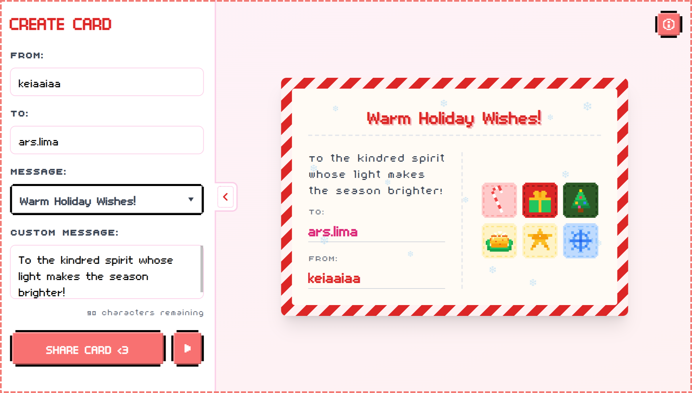

# wshly

<p align="center">
    
    
    
    
    
</p>



**wshly** is a simple, responsive web application for creating cute, little, quirky Holiday cards.

## Getting Started

These instructions will get you a copy of the project up and running on your local machine for development and testing purposes.

### Prerequisites

- Java Development Kit (JDK) 17 or higher
- Apache Maven 3.6.0 or higher

**1. Clone the repository:**

```sh
git clone https://github.com/keiaa-75/wshly.git
cd wshly
```

**2. Build the project:**

```sh
mvn clean install
```

**3. Run the application:**

From your IDE, you can run the `WshlyApplication.java` file as a Spring Boot app. Alternatively, you can use the command line:

```sh
mvn spring-boot:run
```

The application will start on port `8080`.